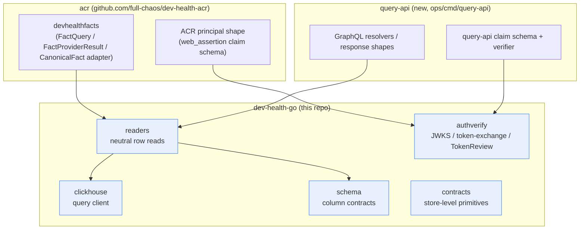

# dev-health-go

Shared Go store/contract library, extracted from `acr` under CHAOS-4377
(Wave 0 of the Go API epic, CHAOS-4352). It exists so `acr` and the new
`query-api` do not each hand-roll ClickHouse column reads against the same
production tables and drift, the way `devhealthsource` and `devhealthfacts`
independently did before (CHAOS-3789/CHAOS-3781).

## Scope

Store/contract layer only. No resolver/response shapes, no GraphQL types,
no consumer principal type.

| Package     | Contents                                                              | Extracted from (acr)                          |
| ----------- | ---------------------------------------------------------------------| ---------------------------------------------- |
| `clickhouse`| Read-only ClickHouse query client, statement/TLS guards, bindings    | `internal/runtime/clickhouse`                  |
| `schema`    | Declared ClickHouse column-type contracts                            | `internal/contextfabric/devhealthschema`       |
| `readers`   | Neutral, column-level ClickHouse row readers over `schema` types     | beneath `internal/contextfabric/devhealthfacts`|
| `contracts` | Store-level validation/versioning primitives                         | `internal/contracts` (store-level subset)      |
| `authverify`| JWKS, k8s TokenReview, workload-token-exchange verification mechanisms| `internal/auth` (mechanism subset)             |

Excluded, and staying in each consumer as its own adapter layer:
`FactQuery`/`FactProviderResult`/`CanonicalFact`/`fact_registry` (acr),
GraphQL resolver/response types (query-api), and any principal/claim shape
(each consumer defines its own on top of `authverify`'s mechanisms).

## Module boundary



## Gates

```bash
make fmt-check   # gofmt
make vet         # go vet ./...
make test        # go test ./...
make verify      # all of the above + build
```

CI (`.github/workflows/ci.yml`) runs the same on every PR and push to `main`.

## Consuming this module

```go
require github.com/full-chaos/dev-health-go v0.1.0
```

During development, a consumer may point a `replace` directive at a local
checkout of this repo; that directive must be removed before the consumer's
PR merges.
