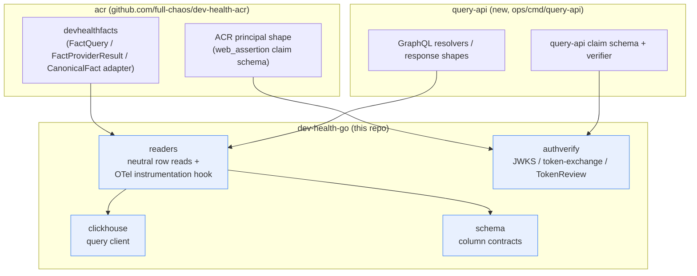

# dev-health-go

Shared Go store/contract library, extracted from `acr` under CHAOS-4377
(Wave 0 of the Go API epic, CHAOS-4352). It exists so `acr` and the new
`query-api` do not each hand-roll ClickHouse column reads against the same
production tables and drift, the way `devhealthsource` and `devhealthfacts`
independently did before (CHAOS-3789/CHAOS-3781).

## Scope

Store/contract layer only. No resolver/response shapes, no GraphQL types,
no consumer principal type.

| Package     | Contents                                                              | Extracted from (acr)                          |
| ----------- | ---------------------------------------------------------------------| ---------------------------------------------- |
| `clickhouse`| Read-only ClickHouse query client, statement/TLS guards, bindings    | `internal/runtime/clickhouse`                  |
| `schema`    | Declared ClickHouse column-type contracts                            | `internal/contextfabric/devhealthschema`       |
| `readers`   | Neutral, column-level ClickHouse row readers over `schema` types, plus a store-level OTel instrumentation hook (see [Boundary corrections](#boundary-corrections-vs-plan-36)) | beneath `internal/contextfabric/devhealthfacts` |
| `authverify`| JWKS, k8s TokenReview, workload-token-exchange verification mechanisms| `internal/auth` (mechanism subset)             |

There is no `contracts` package in this repo -- see [Boundary corrections](#boundary-corrections-vs-plan-36).

Excluded, and staying in each consumer as its own adapter layer:
`FactQuery`/`FactProviderResult`/`CanonicalFact`/`fact_registry` (acr),
GraphQL resolver/response types (query-api), and any principal/claim shape
(each consumer defines its own on top of `authverify`'s mechanisms).

## Boundary corrections vs plan §3/§6

The Go API epic plan (§3/§6) got a few acr package attributions wrong.
Corrections, verified against acr's actual tree:

- **Plan said the ClickHouse client and org-scoping/reader-dedup
  primitives lived in acr's `internal/storage`.** They did not.
  `internal/storage` is acr's own auth/credential/audit domain
  (`Principal`, `CredentialStore`, `DeviceAuthorizationStore`,
  `EvidenceBundle`) and was not extracted into this repo. The ClickHouse
  client actually lived in `internal/runtime/clickhouse` (extracted here as
  `clickhouse`). Org-scoping/isolation for ClickHouse reads was never a
  separate `internal/storage` primitive either -- it lived in acr's
  `internal/contextfabric/devhealthsource` (see that package's
  `clickhouse_org_isolation_integration_test.go`). This repo's
  `readers.QueryOrgScoped` generalizes that pattern.
- **`internal/contracts` and `internal/contractcheck` were inspected and
  explicitly excluded.** Both are entirely ACR wire-contract/API-shaped:
  `ContextPacket`, MCP/OpenAPI generation, ACR's own JSON-Schema
  validators, and a CI-time repo-validation tool. There is no store-level
  subset of either that's reusable without ACR/GraphQL/MCP knowledge, so no
  `contracts` package exists in this repo.
- **`internal/observability` was inspected and explicitly excluded as a
  standalone extracted package.** It's ACR's packet-assembly telemetry
  (`ContextPacket`/episode-assembly), not generic store-level
  instrumentation. acr's `devhealthfacts` (the `readers` package's origin)
  made zero OTel instrumentation calls prior to this extraction -- that's a
  gap being closed here, not a preserved baseline, so `readers` ships its
  own store-level OTel instrumentation hook (`readers.Instrumentation`,
  wired through `readers.QueryOrgScoped`, the funnel every reader calls
  through) in this same PR. It stays store-level only -- no ACR-specific or
  query-api-specific naming -- so each consumer wires its own
  `TracerProvider`/`MeterProvider` in via `readers.ContextWithInstrumentation`
  (a ready-made `readers.OTelInstrumentation` adapter is provided; a
  context that never wires one in behaves as a no-op, unchanged from
  before this hook existed).

## Module boundary



## Gates

```bash
make fmt-check   # gofmt
make vet         # go vet ./...
make test        # go test ./...
make verify      # all of the above + build
```

CI (`.github/workflows/ci.yml`) runs the same on every PR and push to `main`.

## Consuming this module

```go
require github.com/full-chaos/dev-health-go v0.1.0
```

During development, a consumer may point a `replace` directive at a local
checkout of this repo; that directive must be removed before the consumer's
PR merges.
